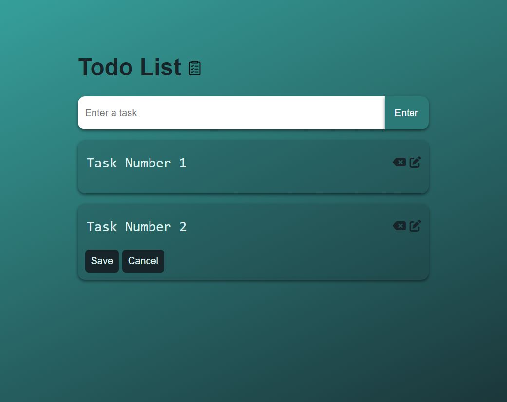

# Todo List App

A simple Todo List application with a clean and responsive design. This application allows users to add, edit, and delete tasks, with the added functionality of persisting tasks using local storage.



## Table of Contents

- [Demo](#demo)
- [Features](#features)
- [Technologies Used](#technologies-used)
- [Project Structure](#project-structure)
- [Getting Started](#getting-started)


## Demo

Check out the live demo [here](https://mehwishjbe.github.io/toDo-list/).

## Features

- **Add Task:** Enter a task in the input field and press the "Enter" button to add it to the list.
- **Edit Task:** Click on the edit icon to enable editing of a task. Click the save button to save the changes.
- **Delete Task:** Click on the delete icon to remove a task from the list.
- **Local Storage:** Utilizes local storage to persist tasks even after refreshing the page.

## Technologies Used
- HTML
- CSS
- JavaScript
- Font Awesome (for icons)

## Project Structure

The project structure is organized as follows:
- `html/` : The main HTML file containing the structure of the application (`index.html`).
- `css/`: The stylesheet file for styling the HTML elements (`style.css`).
- `js/`: The JavaScript file containing the logic for adding, editing, and deleting tasks, as well as interacting with local storage (`main.js`).
- `images/`: Directory containing images used in the application.

## Getting Started

1. Clone the repository:

   ```bash
   git clone https://github.com/mehwishjbe/toDo-list.git
